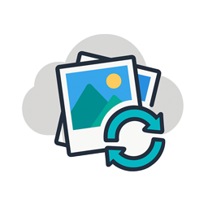

iCloud Shared Album Sync Add-on
This Home Assistant add-on syncs public iCloud Shared Albums to /media or /config/www. It supports multiple albums, pruning by age or count, and mirroring deletions from the album.
Installation

Add this repository to your Home Assistant Add-on Store: https://github.com/yourusername/icloud-shared-album-sync.
Install the "iCloud Shared Album Sync" add-on.
Configure the options in the add-on’s configuration tab.
Start the add-on.

Configuration
Edit the add-on’s configuration in Home Assistant. Example albums YAML:
- name: Family Photos
  shared_url: "https://www.icloud.com/sharedalbum/#XXXXXXXXXXXXXX"
  dest_mode: media
  media_subfolder: "iCloud"
  album_subfolder: "family"
  keep_days: 30
  max_files: 1000
  mirror_missing: true

Options

keep_days: Days to keep files (0 = forever).
max_files: Maximum files to keep (0 = no limit).
timeout: HTTP request timeout (seconds).
interval_minutes: Sync interval (minutes).
debug: Enable debug logging.
mirror_missing: Delete local files missing from the album.
prune_dry_run: Simulate pruning without deleting.
albums: YAML string defining albums.

Notes

Only public iCloud Shared Albums are supported.
Files in /config/www can be served via Lovelace with web_prefix.
Use mirror_missing cautiously, as it deletes local files.

Support
File issues at https://github.com/yourusername/icloud-shared-album-sync/issues.
